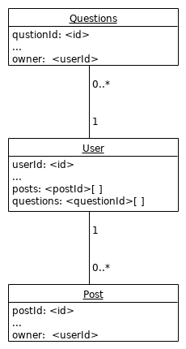
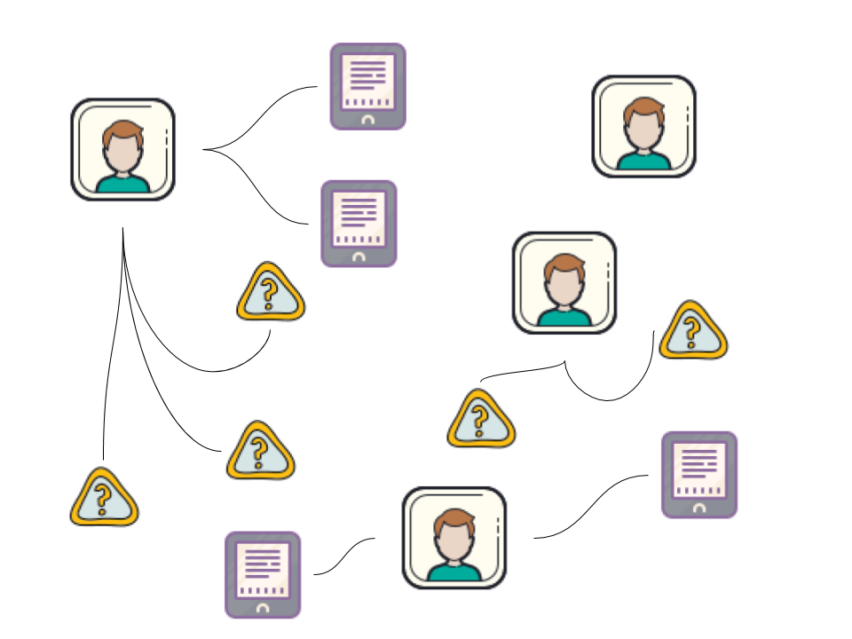
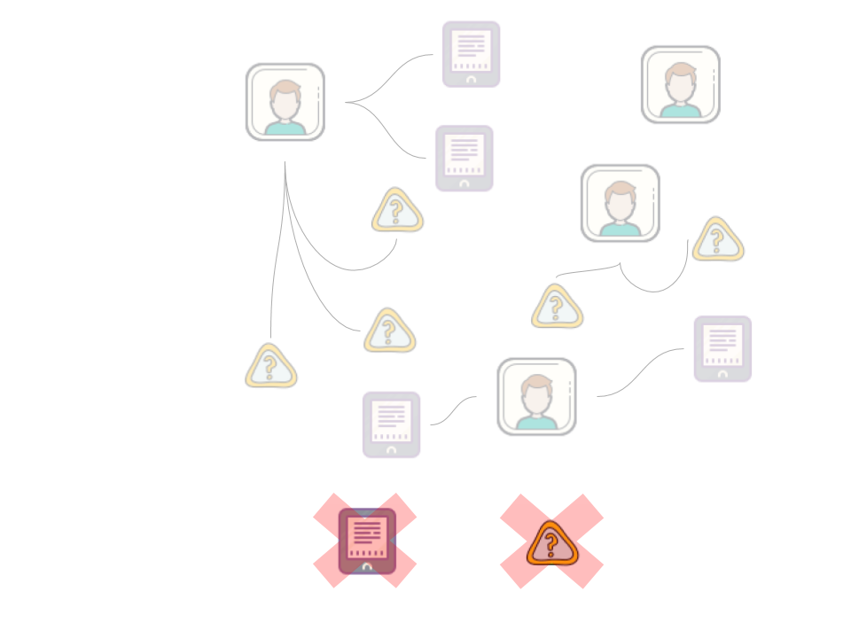

Datenbank
=========

Collections
-----------

Die Datenbank besteht aktuell aus drei Collections:

1.  User (Registrierte Person)
2.  Post (Buchseiten Eintrag)
3.  Question (Generierte Fragen)

Das Schema nachdem die Collections jeweils gestaltet sind ist zu finden
unter `/api/models`.

Relations
---------

CRUD
----

Die API stellt Endpoints für die CRUD Operationen auf diesen Collections
dar.

Diese können vom Frontend, nachdem alle nötigen Daten von den User:innen
gesammelt wurden verwendet werden. Im Backend werden nach dem verändern
eines Dokuments die entsprechenden Verknüpfungen in anderen Dokumenten
bearbeitet, um die Daten konsistent zu halten.

Beispiel: Nachdem die Angaben zu den Daten des:der User:in abgefragt und
in JSON formatiert wurden, werden die Endpoints genutzt, um die Daten
mithilfe des Servers in der Datenbank zu sichern.

Database Logic
--------------

Hier ein Beispiel von möglichen Dokumenten und deren Relationen:

----------------------

Hier ein Beispiel das nicht möglich sein soll, da ein Dokument der
Collection Question oder Post immer eine Relation zu einem Owner
braucht:

